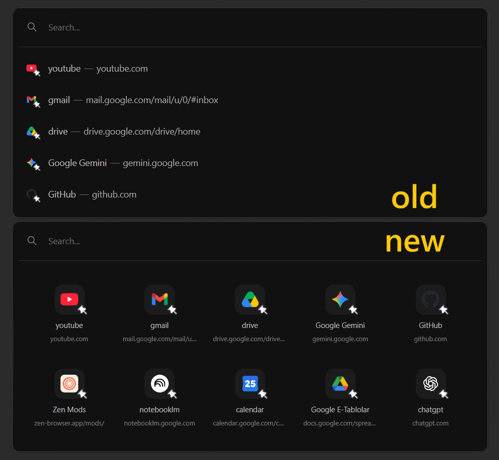

  
  
  

  <a href="https://github.com/ahseyg/zen-grid-search/issues">Report Bug</a>

# Zen Grid Search

Changes the default vertical URL bar suggestions into a simple, customizable grid layout. It only applies to your top sites and history, and smoothly reverts to normal when you start typing.

**Open source** · MIT License · Contributions welcome

---

## Features

- **Grid Layout** — Displays your top sites in a neat 2x5 grid instead of a long vertical list.
- **Premium Feel** — Subtle hover animations and soft drop shadows for a high-quality look.
- **Hide URL Links** — Option to hide the raw URL text, displaying only the website's title.
- **Adjustable Rows** — Choose between a 2-row layout (10 sites), 3-row layout (15 sites), or unlimited scroll.
- **Smart New Tab Detection** — Option to only show the grid when your URL bar is completely empty.

---

## Screenshots

### Premium Grid View

### Customizable Preferences
Control the look and feel directly from the Zen Mods settings panel without touching any CSS.

---

## Installation

### Zen Mods Registry (Recommended)

1. Open Zen Browser.
2. Go to the **Mods Registry**.
3. Search for **Zen Grid Search** and click **Install**.
4. The grid view will automatically apply to your URL bar!

### Manual

1. Download `userChrome.css` and `preferences.json` from the [latest release](https://github.com/ahseyg/zen-grid-search/releases).
2. Follow the standard Zen mod installation procedures to load the CSS and JSON files manually.

---

## Configuration

Once installed, you can configure the mod via the **Zen Mods Settings** page:

| Preference | Description |
| :--- | :--- |
| **Only show grid on New Tab** | If enabled, the grid only activates when your URL bar is completely empty. |
| **Hide URL links** | Hides the raw URL text under the icons. |
| **Grid Rows** | `2 Rows`, `3 Rows`, or `Unlimited (Scrollable)`. |
| **Animation Speed** | `Normal`, `Fast`, or `Disabled`. |

---

## Contributing

- **Bug reports:** [Open an issue](https://github.com/ahseyg/zen-grid-search/issues) — please include your Zen Browser version and a screenshot.
- **Feature requests:** [Open an issue](https://github.com/ahseyg/zen-grid-search/issues)
- **Pull requests:** Fork → Branch → Code → PR

If you find this mod useful, consider giving it a [star](https://github.com/ahseyg/zen-grid-search).

---

## License

MIT — See [LICENSE](LICENSE) for details.

---

  Developed by <a href="https://github.com/ahseyg">ahseyg</a>

